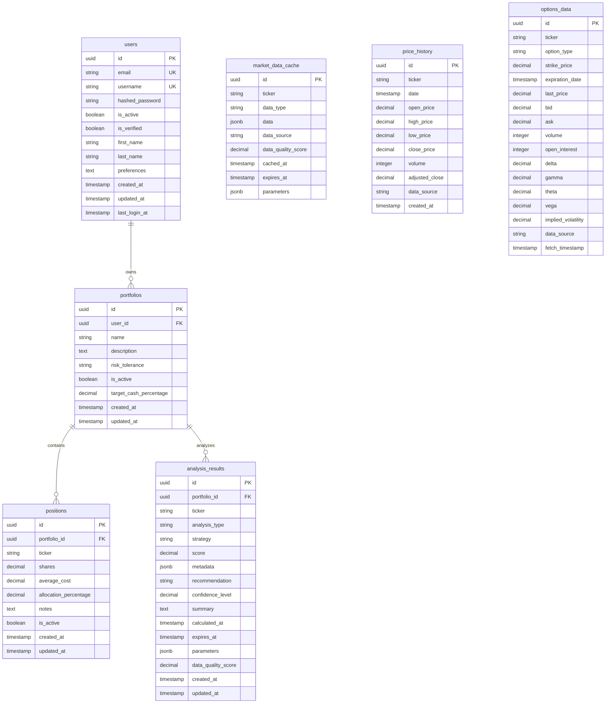

# 🗄️ **BuffetBot Database Schema Design**

## 📋 **Overview**

This document describes the PostgreSQL database schema design for BuffetBot's enterprise-grade financial analysis platform. The schema is designed to support:

- **Multi-user portfolios** with proper isolation
- **Analysis result caching** with expiration management
- **Market data caching** for performance optimization
- **Audit trails** and data lineage tracking
- **Scalable architecture** supporting 1000+ concurrent users

## 🏗️ **Architecture Principles**

### **1. Domain-Driven Design**
- Models organized by business domains (User, Portfolio, Analysis, Market Data)
- Rich domain models with business logic encapsulation
- Clear separation of concerns between domains

### **2. Performance Optimization**
- Strategic indexing for common query patterns
- JSONB fields for flexible metadata storage
- Proper foreign key relationships with cascade rules
- Time-series optimized tables for price history

### **3. Data Integrity**
- UUID primary keys for security and distribution
- Check constraints for business rule enforcement
- Proper normalization to reduce data redundancy
- Audit timestamps on all entities

### **4. Scalability**
- Async-first design with SQLAlchemy 2.0
- Connection pooling and session management
- Prepared for horizontal scaling with proper indexing

## 📊 **Schema Overview**



## 🔍 **Detailed Table Specifications**

### **1. Users Table**

**Purpose**: Store user accounts and authentication information

```sql
CREATE TABLE users (
    id UUID PRIMARY KEY DEFAULT gen_random_uuid(),
    email VARCHAR(255) UNIQUE NOT NULL,
    username VARCHAR(100) UNIQUE,
    hashed_password VARCHAR(255) NOT NULL,
    is_active BOOLEAN DEFAULT TRUE NOT NULL,
    is_verified BOOLEAN DEFAULT FALSE NOT NULL,
    first_name VARCHAR(100),
    last_name VARCHAR(100),
    preferences TEXT, -- JSON string for user preferences
    created_at TIMESTAMP WITH TIME ZONE DEFAULT NOW() NOT NULL,
    updated_at TIMESTAMP WITH TIME ZONE DEFAULT NOW() NOT NULL,
    last_login_at TIMESTAMP WITH TIME ZONE
);

-- Indexes
CREATE INDEX idx_users_email ON users(email);
CREATE INDEX idx_users_username ON users(username);
CREATE INDEX idx_users_active ON users(is_active);
```

**Key Features**:
- UUID primary keys for security
- Unique constraints on email and username
- Flexible preferences storage as JSON
- Audit timestamps for tracking

### **2. Portfolios Table**

**Purpose**: Store user investment portfolios with risk management

```sql
CREATE TABLE portfolios (
    id UUID PRIMARY KEY DEFAULT gen_random_uuid(),
    user_id UUID NOT NULL REFERENCES users(id) ON DELETE CASCADE,
    name VARCHAR(255) NOT NULL,
    description TEXT,
    risk_tolerance VARCHAR(50) NOT NULL CHECK (
        risk_tolerance IN ('conservative', 'moderate', 'aggressive')
    ),
    is_active BOOLEAN DEFAULT TRUE NOT NULL,
    target_cash_percentage NUMERIC(5,2) DEFAULT 5.00 CHECK (
        target_cash_percentage >= 0 AND target_cash_percentage <= 100
    ),
    created_at TIMESTAMP WITH TIME ZONE DEFAULT NOW() NOT NULL,
    updated_at TIMESTAMP WITH TIME ZONE DEFAULT NOW() NOT NULL
);

-- Indexes
CREATE INDEX idx_portfolios_user_id ON portfolios(user_id);
CREATE INDEX idx_portfolios_risk_tolerance ON portfolios(risk_tolerance);
CREATE INDEX idx_portfolios_active ON portfolios(is_active);
```

**Key Features**:
- Foreign key to users with cascade delete
- Risk tolerance enumeration with check constraint
- Target allocation percentages with validation
- Soft delete capability with is_active flag

### **3. Positions Table**

**Purpose**: Store individual stock positions within portfolios

```sql
CREATE TABLE positions (
    id UUID PRIMARY KEY DEFAULT gen_random_uuid(),
    portfolio_id UUID NOT NULL REFERENCES portfolios(id) ON DELETE CASCADE,
    ticker VARCHAR(10) NOT NULL,
    shares NUMERIC(12,4) CHECK (shares >= 0),
    average_cost NUMERIC(12,4) CHECK (average_cost >= 0),
    allocation_percentage NUMERIC(5,2) CHECK (
        allocation_percentage >= 0 AND allocation_percentage <= 100
    ),
    notes TEXT,
    is_active BOOLEAN DEFAULT TRUE NOT NULL,
    created_at TIMESTAMP WITH TIME ZONE DEFAULT NOW() NOT NULL,
    updated_at TIMESTAMP WITH TIME ZONE DEFAULT NOW() NOT NULL,

    UNIQUE(portfolio_id, ticker)
);

-- Indexes
CREATE INDEX idx_positions_portfolio_id ON positions(portfolio_id);
CREATE INDEX idx_positions_ticker ON positions(ticker);
CREATE INDEX idx_positions_active ON positions(is_active);
```

**Key Features**:
- Unique constraint preventing duplicate tickers per portfolio
- Precise decimal handling for financial calculations
- Allocation percentage validation
- Cascade delete with portfolio

### **4. Analysis Results Table**

**Purpose**: Cache analysis results with expiration and metadata

```sql
CREATE TABLE analysis_results (
    id UUID PRIMARY KEY DEFAULT gen_random_uuid(),
    portfolio_id UUID REFERENCES portfolios(id) ON DELETE CASCADE,
    ticker VARCHAR(10) NOT NULL,
    analysis_type VARCHAR(50) NOT NULL CHECK (
        analysis_type IN ('value_analysis', 'growth_analysis', 'health_analysis',
                         'risk_analysis', 'options_analysis', 'ecosystem_analysis')
    ),
    strategy VARCHAR(100),
    score NUMERIC(5,2) CHECK (score >= 0),
    metadata JSONB, -- Complete analysis results
    recommendation VARCHAR(50),
    confidence_level NUMERIC(3,2) CHECK (
        confidence_level >= 0 AND confidence_level <= 1
    ),
    summary TEXT,
    calculated_at TIMESTAMP WITH TIME ZONE DEFAULT NOW() NOT NULL,
    expires_at TIMESTAMP WITH TIME ZONE,
    parameters JSONB, -- Analysis parameters for reproducibility
    data_quality_score NUMERIC(3,2) CHECK (
        data_quality_score >= 0 AND data_quality_score <= 1
    ),
    created_at TIMESTAMP WITH TIME ZONE DEFAULT NOW() NOT NULL,
    updated_at TIMESTAMP WITH TIME ZONE DEFAULT NOW() NOT NULL
);

-- Indexes
CREATE INDEX idx_analysis_portfolio_ticker ON analysis_results(portfolio_id, ticker);
CREATE INDEX idx_analysis_type ON analysis_results(analysis_type);
CREATE INDEX idx_analysis_calculated_at ON analysis_results(calculated_at);
CREATE INDEX idx_analysis_expires_at ON analysis_results(expires_at);
CREATE INDEX idx_analysis_ticker ON analysis_results(ticker);
```

**Key Features**:
- JSONB storage for flexible analysis metadata
- Expiration-based caching with automatic cleanup
- Analysis type enumeration for consistency
- Confidence and quality scoring
- Parameter storage for reproducibility

### **5. Market Data Cache Table**

**Purpose**: Unified cache for all types of market data

```sql
CREATE TABLE market_data_cache (
    id UUID PRIMARY KEY DEFAULT gen_random_uuid(),
    ticker VARCHAR(10) NOT NULL,
    data_type VARCHAR(50) NOT NULL,
    data JSONB NOT NULL,
    data_source VARCHAR(50),
    data_quality_score NUMERIC(3,2) CHECK (
        data_quality_score >= 0 AND data_quality_score <= 1
    ),
    cached_at TIMESTAMP WITH TIME ZONE DEFAULT NOW() NOT NULL,
    expires_at TIMESTAMP WITH TIME ZONE NOT NULL CHECK (expires_at > cached_at),
    parameters JSONB,

    UNIQUE(ticker, data_type, parameters)
);

-- Indexes
CREATE INDEX idx_market_cache_ticker_type ON market_data_cache(ticker, data_type);
CREATE INDEX idx_market_cache_expires_at ON market_data_cache(expires_at);
CREATE INDEX idx_market_cache_cached_at ON market_data_cache(cached_at);
```

**Key Features**:
- Unified caching for all market data types
- Flexible JSONB storage for different data structures
- Parameter-based cache keys for complex queries
- Automatic expiration management

### **6. Price History Table**

**Purpose**: Optimized storage for historical price data

```sql
CREATE TABLE price_history (
    id UUID PRIMARY KEY DEFAULT gen_random_uuid(),
    ticker VARCHAR(10) NOT NULL,
    date TIMESTAMP WITH TIME ZONE NOT NULL,
    open_price NUMERIC(12,4) CHECK (open_price > 0),
    high_price NUMERIC(12,4) CHECK (high_price > 0),
    low_price NUMERIC(12,4) CHECK (low_price > 0),
    close_price NUMERIC(12,4) NOT NULL CHECK (close_price > 0),
    volume INTEGER CHECK (volume >= 0),
    adjusted_close NUMERIC(12,4),
    data_source VARCHAR(50) DEFAULT 'yfinance',
    created_at TIMESTAMP WITH TIME ZONE DEFAULT NOW() NOT NULL,

    UNIQUE(ticker, date)
);

-- Time-series optimized indexes
CREATE INDEX idx_price_ticker_date ON price_history(ticker, date);
CREATE INDEX idx_price_date_ticker ON price_history(date, ticker);
CREATE INDEX idx_price_ticker_date_desc ON price_history(ticker, date DESC);
```

**Key Features**:
- Time-series optimized for financial data queries
- Precise decimal handling for price data
- Multiple index strategies for different query patterns
- Data source tracking for audit trails

### **7. Options Data Table**

**Purpose**: Store options chain data with Greeks

```sql
CREATE TABLE options_data (
    id UUID PRIMARY KEY DEFAULT gen_random_uuid(),
    ticker VARCHAR(10) NOT NULL,
    option_type VARCHAR(4) NOT NULL CHECK (option_type IN ('call', 'put')),
    strike_price NUMERIC(12,4) NOT NULL CHECK (strike_price > 0),
    expiration_date TIMESTAMP WITH TIME ZONE NOT NULL,
    last_price NUMERIC(12,4) CHECK (last_price >= 0),
    bid NUMERIC(12,4) CHECK (bid >= 0),
    ask NUMERIC(12,4) CHECK (ask >= 0),
    volume INTEGER CHECK (volume >= 0),
    open_interest INTEGER CHECK (open_interest >= 0),
    delta NUMERIC(6,4) CHECK (delta >= -1 AND delta <= 1),
    gamma NUMERIC(8,6),
    theta NUMERIC(8,6),
    vega NUMERIC(8,6),
    implied_volatility NUMERIC(6,4) CHECK (implied_volatility >= 0),
    data_source VARCHAR(50) DEFAULT 'yfinance',
    fetch_timestamp TIMESTAMP WITH TIME ZONE DEFAULT NOW() NOT NULL
);

-- Options-specific indexes
CREATE INDEX idx_options_ticker_expiration ON options_data(ticker, expiration_date);
CREATE INDEX idx_options_ticker_type_exp ON options_data(ticker, option_type, expiration_date);
CREATE INDEX idx_options_expiration_strike ON options_data(expiration_date, strike_price);
CREATE INDEX idx_options_fetch_timestamp ON options_data(fetch_timestamp);
```

**Key Features**:
- Complete options chain data with Greeks
- Expiration and strike-based indexing
- Validation constraints for financial data
- Time-based cleanup capabilities

## 🔧 **Performance Optimizations**

### **1. Indexing Strategy**

**Primary Indexes**:
- All tables have UUID primary keys with automatic indexing
- Foreign key columns are indexed for join performance
- Timestamp columns are indexed for time-based queries

**Composite Indexes**:
- `(portfolio_id, ticker)` for position lookups
- `(ticker, date)` for price history queries
- `(ticker, data_type)` for cache lookups

**Specialized Indexes**:
- Descending date indexes for latest-first queries
- Partial indexes for active records only
- JSONB GIN indexes for metadata queries (future enhancement)

### **2. Query Optimization**

**Connection Pooling**:
```python
# Configured in database/connection.py
pool_config = {
    "pool_size": 20,
    "max_overflow": 30,
    "pool_pre_ping": True,
    "pool_recycle": 3600,  # 1 hour
}
```

**Async Operations**:
- All repository methods have async variants
- Proper session management with context managers
- Batch operations for bulk data processing

### **3. Caching Strategy**

**Multi-Level Caching**:
1. **Database Cache**: `market_data_cache` table with TTL
2. **Analysis Cache**: `analysis_results` table with expiration
3. **Application Cache**: Redis integration (future phase)

**Cache Invalidation**:
- Time-based expiration with `expires_at` columns
- Manual invalidation through repository methods
- Cleanup jobs for expired data

## 🛡️ **Security Considerations**

### **1. Data Protection**

**UUID Primary Keys**:
- Prevents enumeration attacks
- Enables distributed system scaling
- Provides natural obfuscation

**Password Security**:
- Hashed passwords only (never plaintext)
- Separate authentication service integration ready

**Data Isolation**:
- User-based data isolation through foreign keys
- Row-level security ready for multi-tenancy

### **2. Audit Trail**

**Timestamp Tracking**:
- `created_at` and `updated_at` on all entities
- `last_login_at` for user activity tracking
- `calculated_at` for analysis freshness

**Data Lineage**:
- `data_source` tracking for all market data
- `parameters` storage for analysis reproducibility
- `data_quality_score` for reliability assessment

## 📈 **Scalability Design**

### **1. Horizontal Scaling Ready**

**Partitioning Strategy**:
- Time-based partitioning for `price_history` (future)
- User-based partitioning for `portfolios` (future)
- Analysis type partitioning for `analysis_results` (future)

**Read Replicas**:
- Read-heavy queries can use replica databases
- Analysis and reporting workloads can be separated

### **2. Data Archival**

**Historical Data Management**:
- Automated archival of old price history data
- Analysis result cleanup based on expiration
- User data retention policies

**Backup Strategy**:
- Point-in-time recovery capability
- Cross-region backup replication
- Automated backup verification

## 🚀 **Migration Strategy**

### **1. Alembic Integration**

**Migration Management**:
```bash
# Generate new migration
alembic revision --autogenerate -m "Add new feature"

# Apply migrations
alembic upgrade head

# Rollback if needed
alembic downgrade -1
```

**Version Control**:
- All schema changes tracked in version control
- Automated migration testing in CI/CD
- Rollback procedures documented

### **2. Data Migration**

**Existing Data Integration**:
- ETL scripts for current file-based cache
- Gradual migration with dual-write strategy
- Data validation and integrity checks

## 📊 **Monitoring and Maintenance**

### **1. Performance Monitoring**

**Key Metrics**:
- Query execution times
- Connection pool utilization
- Cache hit rates
- Data freshness metrics

**Alerting**:
- Slow query detection
- Connection pool exhaustion
- Cache expiration monitoring
- Data quality degradation

### **2. Maintenance Tasks**

**Automated Cleanup**:
- Expired cache data removal
- Old analysis result archival
- Unused market data cleanup

**Index Maintenance**:
- Regular index rebuilding
- Statistics updates
- Query plan optimization

## 🔄 **Integration Points**

### **1. Current BuffetBot Integration**

**Data Fetcher Integration**:
- Repository pattern replaces direct file caching
- Async data fetching with database storage
- Fallback to existing fetchers during transition

**Analysis Engine Integration**:
- Analysis results stored in database
- Parameter tracking for reproducibility
- Quality scoring integration

### **2. Future Enhancements**

**API Layer Integration**:
- RESTful endpoints using repository pattern
- GraphQL support for flexible queries
- Real-time subscriptions for data updates

**Service Layer Integration**:
- Business logic encapsulation
- Transaction management
- Event-driven architecture support

This schema design provides a solid foundation for BuffetBot's evolution into an enterprise-grade financial analysis platform while maintaining compatibility with existing functionality.
